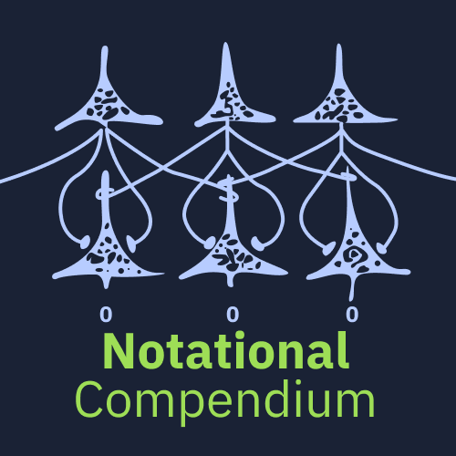
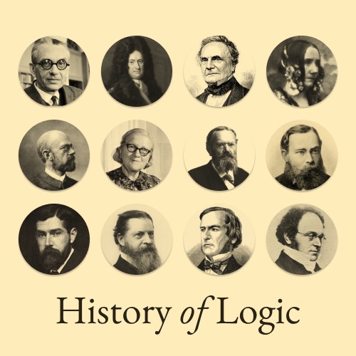

## Prathyush Pramod
### Interface Designer × Map Maker

I am a user interface designer turned developer turned math enthusiast who focuses on [lambda calculus](https://twitter.com/prathyvsh/status/1188787773441888257), and analysis. I enjoy making cognitive maps and interfaces to understand science and philosophy so that an enthusiast can accessibly understand the lay of the land of technical subjects.

As a part of my explorations, I was lead to track the history of these subjects. I actively catalogue some of these. Currently working on: https://github.com/prathyvsh/history-of-computers

<table>
  <tr>
  <th><a href="https://github.com/prathyvsh/formal-systems-in-biology">Formal Systems in Biology</a></td>
  <th><a href="https://github.com/prathyvsh/notation">Notational Compendium</a></td>
  <th><a href="https://github.com/prathyvsh/history-of-logic">History of Logic</a></td>
  </tr>
  
  <tr><td></td>
<td></td>
<td><a href="https://github.com/prathyvsh/history-of-logic"></td></a></tr>

<tr>
  <th><a href="https://github.com/prathyvsh/lambda-calculus">Lambda Calculus</a></td>
  <th><a href="https://github.com/prathyvsh/typefaces">Open Typefaces</a></td>
  <th><a href="https://github.com/prathyvsh/category-theory-resources">Category Theory Resources</a></td></tr>
    <tr><td></td>
<td></td>
<td><a href="https://github.com/prathyvsh/category-theory-resources"></td></a></tr>

</table>
